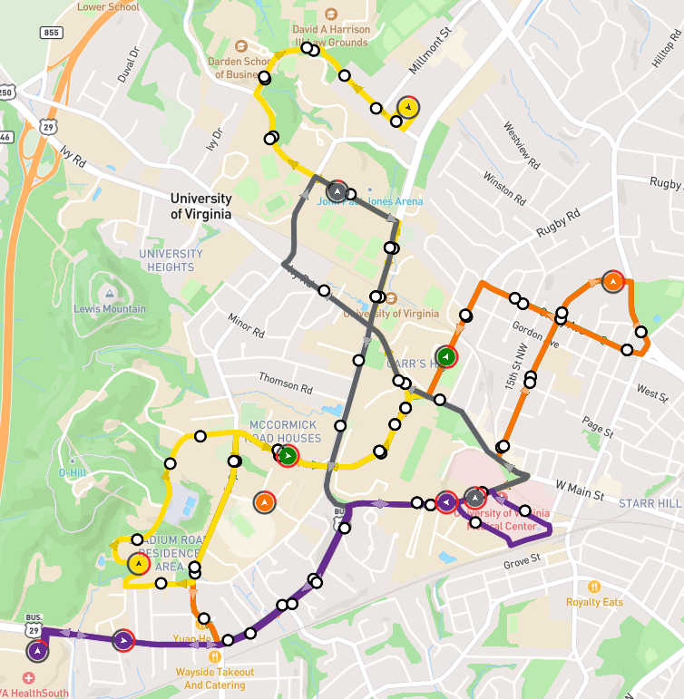

# GoHoos

Real-time UVA transit app with live bus tracking, route exploration, and trip planning for UTS riders on Grounds and in Charlottesville.

Built to fix the gap between UTS's official app and what students actually need to catch a bus on time.



## Status

**Live today**

- **Route planner (home page)** — start/destination stop selection and map UI are in place alongside route recommendations and ETAs
- **Routes page** — interactive Mapbox map with UTS route lines and stops (GTFS), live vehicle positions, route search/toggle, and bus detail popups (speed, route, passenger count when available)
- **About page** — product overview, feature walkthrough, and roadmap

**Under active development**

- **Historical ETAs**
- **Break Notifications**

GoHoos is an independent student project and is not affiliated with the University of Virginia, UVA Transportation Services, or TransLoc.

## Tech stack

| Layer | Tools |
| --- | --- |
| Frontend | [Next.js](https://nextjs.org/) 16, [React](https://react.dev/) 19, [TypeScript](https://www.typescriptlang.org/), [Tailwind CSS](https://tailwindcss.com/) |
| Maps | [Mapbox GL JS](https://docs.mapbox.com/mapbox-gl-js/) |
| Transit data | [GTFS](https://gtfs.org/) (static routes, shapes, stops) + UVA TransLoc vehicle feed (via Next.js `/api/vehicles`) |
| Backend | [Express](https://expressjs.com/) — work in progress; will be finished after the route planner ships (ETA prediction / tracking) |

## Project structure

```
frontend/   Next.js app (UI, map, GTFS JSON data, `/api/vehicles` TransLoc proxy)
backend/    Express API (WIP — planned for planner/ETA work)
```

## Setup

### Prerequisites

- Node.js 20+
- A [Mapbox access token](https://account.mapbox.com/access-tokens/)

### Frontend

```bash
cd frontend
npm install
```

Create `frontend/.env.local`:

```env
NEXT_PUBLIC_MAPBOX_ACCESS_TOKEN=your_mapbox_token_here
```

Start the dev server:

```bash
npm run dev
```

Live vehicle positions and capacity are fetched server-side from TransLoc through `GET /api/vehicles` (polled every 5 seconds on the routes map and home planner). The Express `backend/` package is not required for local development right now.

Open [http://localhost:3000/routes](http://localhost:3000/routes) for the live route map, or [http://localhost:3000/about](http://localhost:3000/about) for the product overview.

### GTFS data (optional)

Static route data lives in `frontend/src/data/json/`. To regenerate from raw GTFS files in `frontend/src/data/raw/`:

```bash
cd frontend
npm run convert:gtfs
```

## Contact

Built by [Alan Tobin](https://github.com/AlanTobin) — feedback and issues welcome on [GitHub Issues](https://github.com/AlanTobin/GoHoos/issues).
